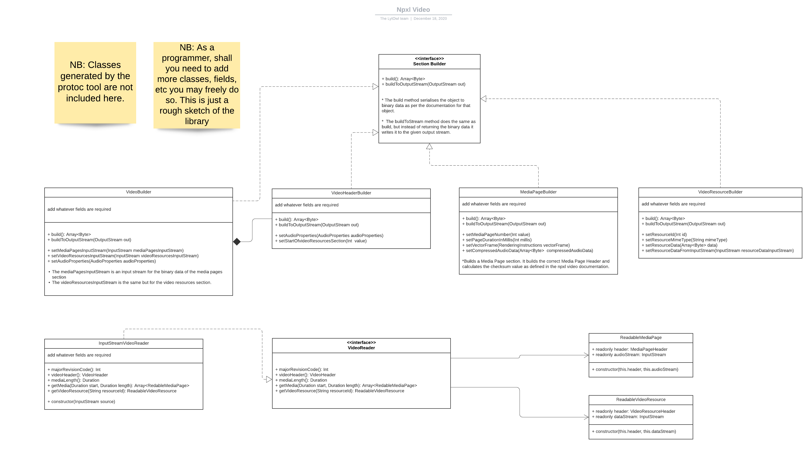
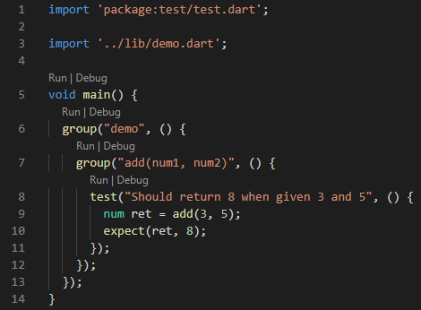

# No Pixels Video (npxl video)


This library is the reference implementation of the [npxl video format](docs/introduction.md). It serves only the
purpose of reading and writing npxl files and is, therefore, written in pure dart with no platform specific functionality. It does not implement the capability to play the video format on any
platform.

The npxl video format uses [opus](https://opus-codec.org/) as its audio codec. This library, however, does not come with
libopus classes. It is up to the user of the library to do the encoding and decoding of audio. The LytOwl team will
provide a simple libopus library specifically for use with this library in the near future.

## Understanding this library



## Generating `npxl_video.pb.dart` from the proto file

This should be done only when [npxl_video.proto](docs/npxl_video.proto) is modified.

Do the following to generate the dart classes from [npxl_video.proto](docs/npxl_video.proto):

1. Have the [latest](https://github.com/google/protobuf/releases/latest) version of protoc installed and in your PATH
   variable
2. Install the Dart protoc plugin with `pub global activate protoc_plugin`.
3. Add `C:\Users\xxx\AppData\Roaming\Pub\Cache\bin` to your PATH variable if you had not done so before and refresh your terminal. If the path is not in your PATH variable, a warning should appear in step 2 above, with the correct path to be added to your PATH variable.
4. Now, from the top level folder of this repo, generate the dart code with:

```bash
protoc -I=docs --dart_out=lib/generated docs/npxl_video.proto
```

These instructions are assuming you're on a Windows machine. For more info, pleas refer to [Protocol Buffers for Dart](https://developers.google.com/protocol-buffers/docs/darttutorial#compiling-your-protocol-buffers).

## Unit testing

### Adding unit tests

Unit tests should be added to the `test/` folder. Each file name must end with `_test.dart` for the dart test tool to find it.

```dart
import 'package:test/test.dart';

import '../lib/demo.dart';

void main() {
  group("demo", () {
    group("add(num1, num2)", () {
      test("Should return 8 when given 3 and 5", () {
        num ret = add(3, 5);
        expect(ret, 8);
      });
    });
  });
}
```

### Running unit tests from the command line

First make sure all packages are resolved my running `pub get` from your terminal. Then run the unit tests with `dart test`.

### Running the unit tests from VsCode

This is probably the easiest way to run the unit tests. Once the IDE has fully loaded the project, you should see the `Run | Debug` options options above each test group and test like in the following image. Clicking on any `Run` option will run that group or test while ignoring breakpoints. Click the `Debug` option to have the test runner stop at breakpoints.


