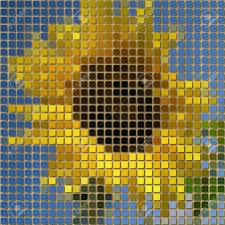

# Using vector graphics for e-learning videos

To understand the problem to be presented, we first need to understand how digital videos are captured. In its simplest form, a video is a series of images displayed one after the other. A single image is called frame. Most videos are captured at 24 frames per second (fps). A frame is an image bitmap made up of pixels where each pixel has a single color. Together these pixels form the image we see.

 _A bitmap is a grid of pixels. [Source](https://www.123rf.com/photo_32803799_sunflower-pixelated-image-generated-texture.html)_

Standard Definition videos use bitmap grids of 720 x 480 pixels while High Definition videos have at least 1280 x 720 bitmap grids. The quality of the video is directly proportional to the size of the bitmap grids the video has. As the size of the bitmap grids increase the quality of the video gets better and vice versa. The problem with this relationship between video image quality and the bitmap grids size is the effect they have on the final video file. A video of higher image quality has bigger file size than the same video of a smaller image quality.

It is for this simple problem that many children in Africa and Asia are left out of the online learning revolution taking place as we go deeper into the fourth industrial revolution. Data is expensive. Many content providers have come to understand this. They upload low resolution videos to make them more accessible, but this of course makes learning difficult especially for the visually impaired children. High quality e-learning through video is supposed to be accessible to every child out there, and not reserved for only those who afford it.

The goal of this project is to develop a video format for e-learning videos whose image quality does not change the file size. The goal is to allow the making of video files that can be played on any device at the highest image quality that devices' display can support. We aim to achieve this by replacing the bitmap part of a video with vector graphics.

This video format targets voice of slide educational videos, like those made by Khan Academy, Mindset Learn, and other such organizations. Therefore, all design choices and decisions will be made with these types of videos in mind.

## Engineering Goals

1. Develop a video format whose frames are resolution independent by using vector graphics [ ]
2. The video format is specifically designed for voice over slide educational videos [ ]
3. Videos should be able to be saved to files and replayed when needed (video file format) [ ]
4. Videos should be network streamable with modern and secure media streaming APIs and techniques [ ]

Once these 4 goals are achieved a new and innovative video format will be born.

## Understanding the npxl video format

Please read [npxl_video.proto](npxl_video.proto)
